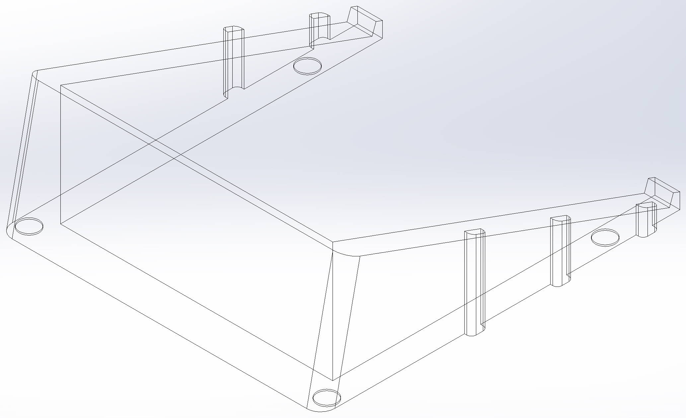

## ergodox-tent

I love my ergodox, and I've come to appreciate the ergonomics of tenting thanks to [Adereth's ergodox tent stand](https://github.com/adereth/ergodox-tent). That stand was designed for the rubber feet to settle in some holes on the top of the stand, which worked pretty great while the adhesive on the rubber feet is strong, but eventually the adhesive tended to slip and my keyboard would slip around.

This tent has physical supports, and with rubber feet on the bottom, it's much more steady than I've ever found the other one to be. I've also added a higher tent angle (20 degrees) than the adereth one.

This fits the Litster acrylic ergodox case; I've attached the solidworks file in case you want something similar but need to tweak the dimensions or tent angle a bit. IIUC you may need to use a solidworks [maker license](https://discover.solidworks.com/3dexperience-solidworks-makers) to open and edit these.

### print tips

I printed this on the prusa mk3s, with the 0.15mm quality setting and 15% infill it used about 70g of filament for each side. I'd suggest printing face up and using supports so the recessed feet holes come out nicely, but that might be overkill.
